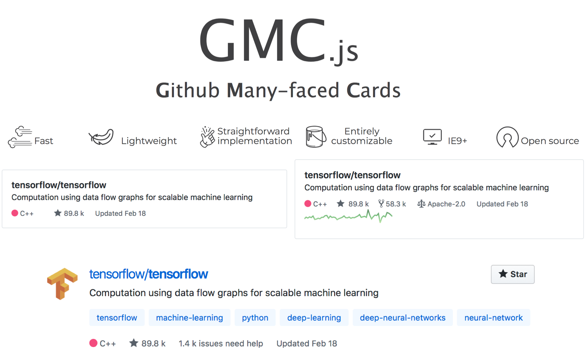

<div style="text-align:center">
	
</div>

## Loading and error states

<div style="text-align:center">
	
	
</div>


<p align="center"> >>>>>>> <a href="http://tsucres.me/GithubManyfacedCards/"><strong>DEMO</strong></a> <<<<<<< </p>

## Usage

There are several ways you can implement many-faced cards, according to the level of customization you need. Checkout out the [**Card Generator**](http://tsucres.me/GithubManyfacedCards/demo/generator.html) for an easier integration.

### Easiest

```html
<iframe src="https://cdn.jsdelivr.net/gh/tsucres/GithubManyfacedCards@0.3.0/dist/themes/<theme_name>/embedded/embedded.gmc.min.html?<rn|un>=<<full_repo_name>|<username>>" frameborder="0"></iframe>
```


Where 
- `<rn|un>` should be replaced by `rn` if you want a repo-card or by `un` if you want a user-card;
- `<theme_name>` must be the name of one of the [supported themes](http://tsucres.me/GithubManyfacedCards). You can host and use your own themes. Read further to learn how to build custom themes. The default theme, (if you omit this param) is `gh_pure`;
- `<full_repo_name>` must have the following format: `userName/repoName`;
- `<username>` must be a valid GitHub username.


[**jsFiddle** >> ](https://jsfiddle.net/tsucres/Ltbejcto/)


### Separated js

Choose an existing theme and paste the following markup in your webpage source: 

```html
<!-- in the head or in the beginning of the body -->
<script src="https://cdn.jsdelivr.net/gh/tsucres/GithubManyfacedCards@0.3.0/dist/gmc.min.js">

<!-- ... -->

<!-- where you want a repo-card -->
<script async src="https://cdn.jsdelivr.net/gh/tsucres/GithubManyfacedCards@0.3.0/dist/gmc-loader.min.js" data-gmc-repo="<full_repo_name>" data-gmc-theme="<theme_name>"></script

<!-- where you want an user-card -->
<script async src="https://cdn.jsdelivr.net/gh/tsucres/GithubManyfacedCards@0.3.0/dist/gmc-loader.min.js" data-gmc-user="<username>" data-gmc-theme="<theme_name>"></script>

```

Again, the `<theme_name>` must be replaced with the name of one of the supported theme names. By default, if you omit it, the theme is `gh_pure`.

This way must be preferred if you plan to have several cards on a single webpage, or if you need to load the cards programmatically, or even if you need a custom version of the gmc.js script.

The advantages of this method over the previous one are: 
- No iframe: the markup is dynamically added as a sibling of the `<script>` tag
- You can easily add a responsive behavior to the card
- Since the card is directly inside the document, you can override the style of the theme.
- If you use the same theme for several cards, the styles and the js code needed by the theme are loaded only once
- The `gmc.js` script is loaded only once (in the first implementation method, it is embedded in every iframe)
- You can use a custom version of `gmc.js`


With this method, you should load `gmc.js` at the beginning of your html (to ensure that the `GMC` function exists in the document when the card is loaded). The script is a couple of kb and is served with a cdn (rawgit or jsdelivr), so it shouldn't be a big deal.

<!-- JSFiddle link -->
[**jsFiddle** >> ](https://jsfiddle.net/tsucres/wt4pq0qu/)


### Most efficient way

This method consists in doing manually what `gmc-loader.js` does: load and insert the template of the card in the document and add the style and the javascript it requires. 

This method has all the advantages of the previous one and is slightly more efficient since it has less markup to generate dynamically and fewer files to fetch.

##### 1. Insert the markup of the theme

Copy/Paste the markup of the theme you want to use directly in your webpage. 

You can find the markup of the existing themes in the [`dist/themes/<theme_name>/`](dist/themes/) folders. Of course, you can build your own (see next section).


##### 2. Add the style

In the head of your document, add the style needed by your theme.

For the existing themes, you will find the required css file in the following folder: [`dist/themes/<theme_name>`](dist/themes). You can either serve it yourself or use a CDN:

```html
<link rel="stylesheet" href="https://cdn.jsdelivr.net/gh/tsucres/GithubManyfacedCards@0.3.0/dist/themes/<theme_name>/<theme_name>.min.css" type="text/css">
```


##### 3. Add the js

Add the js functions needed by the template to your document.


For the existing themes, the js file is in the theme's folder [`dist/themes/<theme_name>`](dist/themes). As for the style, you can either serve it yourself or use rawgit:

```html
<script src="https://cdn.jsdelivr.net/gh/tsucres/GithubManyfacedCards@0.3.0/dist/themes/<theme_name>/<theme_name>.min.js"></script>
```


##### 4. GMC.js

Add a link to `gmc.min.js` and call `GMC.loadAllCards()` when you want to load the cards (after the document has loaded): 

```html
<script src="https://cdn.jsdelivr.net/gh/tsucres/GithubManyfacedCards@0.3.0/dist/gmc.min.js"></script>

<script>
// Call GMC.loadAllCards() when the document has loaded 
window.onload = function() { GMC.loadAllCards(); };
</script>

```


<!-- JSFiddle link -->
[**jsFiddle** >> ](https://jsfiddle.net/tsucres/t2vqLrmp/)


## Build custom themes


1. Design the theme: build the markup;
2. Turn it into a Github template: add the adequate data attributes in the right spots.


There are three kinds of data-* attributes you can use to indicate to gmc.js which tags to fill with what information: `data-gmc-id`, `data-gmc-js` and `data-gmc-ap`.

The most important one is `data-gmc-id`. Its value should have the following syntax: `where__what__js` 

1. `where` corresponds to the attribute to which to assign the `what` value. (Note that `in` is an alias for `textContent`).
2. `what` must correspond to a key in the json response from the Github API for a [repo](https://developer.github.com/v3/repos/#get) or a [user](https://developer.github.com/v3/users/#get-a-single-user). The hierarchy is specified using a dash `-`. For example, to access `json["parent"]["child"]`, the `what` part of `data-gmc-id` would be `parent-child`.
3. `js`: this part is optional. If `__js` is appended at the end of the attribute and the `data-gmc-js` attribute of the element contains the name of a js function, the `what` will be first passed to that function (as a parameter) and its result will be assigned to the `where`. The js function is called with 3 parameters: the `what`, the `HTMLElement` and the javascript GMC object handling the template.


Examples: 

- `href__full_name` will fill the `href` attribute of the element with the value identified by `full_name` in the API response.
- `in__owner-login` will fill content of the element with the value in `json['owner']['login']` 
- `href__id__js` will fill the `href` attribute of the element with the result of the function in `data-gmc-js` when `json['id']` is passed as parameter. For example `function concat_url(val) {return 'https://website.com/id=' + val}`

**Note** that if the `where` already has a value, the `what` will replace it. If you want, instead, to keep the value of the `where` and append the `what` at the end of it, you have to add the attribute `data-gmc-ap`. Thus, the last example above could also be implemented as `<a href="https://website.com/id=" data-gmc-id="href__id" data-gmc-ap>click</a>`


## How it works

#### 0) For each [data-gmc-repo] elements ...

The two following steps are executed for every element selected with the attribute `data-gmc-repo` (or `data-gmc-user` in case the case of a user-card).


#### 1) Data fetching

This part is pretty obvious: it uses the [official API](https://developer.github.com/v3/repos/) to retrieve the informations about the repo (or a user) in Json format.


#### 2) Parsing and rendering

When the Json is made available, gmc.js will parse all the child elements of the `[data-gmc-repo]` element and look for those having a `data-gmc-id` attribute. For all of those, it will parse the id, and fill the template. For an id `where__what__js` it will basically do the following: `[data-gmc-repo].where (+)= js(json[what])`


## Complete doc

### Supported data-* attributes

#### On the root element

**data-gmc-repo**: the full name (userName/repoName) of the repo you want to show the informations for. This attribute is always required, except when embedding the iframe with the `src=theme.gmc.min.html?rn=fullName`.

**data-gmc-user**: same as the previous one but for user-cards.


If the root element is an **iframe** with `data-gmc-repo` specified (without `src`): 

**data-gmc-theme**: the value must be a valid name for a theme. Currently supported themes are `gh_pure`, `gh_full`, `gh_recommendation`.

**data-gmc-theme-url**: the url pointing to a theme template (html). It can be relative or absolute. It's accessed using an XMLHttpRequest.

At least one of those is required. **data-gmc-theme-url** has a higher priority than **data-gmc-theme**.

#### On the inner elements (in the template)

**data-gmc-id**: its value must have the format `where__what[__js]`. See the previous 'Build custom themes' section.

**data-gmc-js**: only useful if the `data-gmc-id` has the `__js` suffix. It must contain the name of a javascript function. Note that the function has to be defined in the same document as the template, i.e. in the iframe (in the template pointed by data-gmc-theme[-url]) if the root element is an iframe or in the main document otherwise.


**data-gmc-ap**: if this attribute is added to an element (with `data-gmc-id`), the `what` will be appended at the end of the `where`. By default, the value in `where` is replaced.

### Javascript methods

##### new GMC(root_el)

Fill the template inside `root_el`.

The `root_el` is the one having the `data-gmc-repo` attribute: either an iframe or an HTMLElement with a Github template inside of it.


##### GMC.loadAllCards()

Calls `(new GMC(root_el))` on every elements selected by `[data-gmc-repo]`.


### Used classes

**gmc-loaded** is added to the root_el (the one with the `data-gmc-repo`) when all the `data-gcm-id` elements were filled.

**gmc-error** is added to the root_el if the status code of the API response is different than 200.


## Build from sources

```sh
npm install

gulp all #[themes, embed_themes, gmc]

```

- the `themes` task outputs the html files (for each theme) containing all the styles and the js functions needed. Those themes are intended to be used inside an iframe, but still need the gmc.js file to be embedded on the parent document. Those themes are the ones used in the second (see first section).

- the `embed_themes` task outputs the same files as the previous one, but in addition to the style and js functions, the content of gmc.js along with an automatic call to `GMC.loadAllCards()` is added to those files. Those themes are intended to be used in a standalone iframe (usage 1 in the first section). They are marked with the `.gmc` suffix in the [`dist`](dist) folder.

- the `gmc` task minifies the gmc.js file.

All the resulting files (except the demo file) are in the [`dist`](dist) directory.


# Examples

See the [demo](http://tsucres.me/GithubManyfacedCards/) for several card designs.


Real life examples: 
- [HNBuddy landing page](http://www.hnbuddy.io/contrib.html)

**Open an issue** to submit your designs in the demo or to add a link here in the [README](README.md)


# Other similar repos: 

- [github-cards](https://github.com/lepture/github-cards): same thing as GMC but with less easily customisable/extendable themes.
- [GithubCard](https://github.com/xuelangZF/GithubCard): other design for the same thing. This implementation is very simple.
- [github-calendar](https://github.com/IonicaBizau/github-calendar): a widget displaying the yearly contribution calandar.

